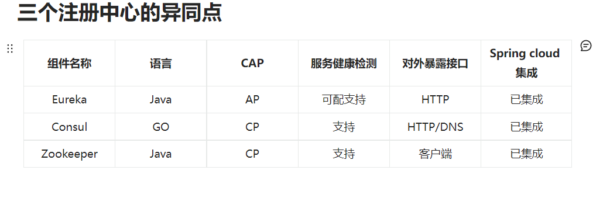

学习springcloud微服务架构所做练习，其中不涉及具体的业务流程，仅仅是为了初学时各种组件与cloud框架的配合使用。
## 学习流程与模块间的关系
**cloud_commons** 为公共类
### eureka 服务注册中心
**单机服务器**  eureka-server7001 payment801
**集群服务器**  eureka-server7001 eureka-server7002 payment801 payment8002

### zookeeper服务注册中心
cloud-consumerzk-order80 服务端
cloud-providerzk-payment8004 客户端

### Consul注册中心
cloud-consumer-consul-order80 客户端
cloud-provider-consul-payment8006 服务端

### ribbon负载均衡
架构说明：Ribbon其实是一个软负载均衡的客户端组件，它可以和其他所需请求的客户端结合使用，和eureka结合只是启动一个实例
服务端、客户端设置与eureka集群相同

### openfeign负载均衡
cloud-consumer-feign-order80 客户端
eureka-server7001 eureka-server7002 服务器 payment801 payment8002 服务端

### hystrix断路器,进行服务降级，熔断、监控等功能
模块
cloud-consumer-feign-hystrix-order80 模拟客户端 访问接口localhost/consumer/payment/hystrix/ok/1
cloud-provider-hystrix-payment8001 模拟服务端 访问接口localhost:8001/payment/hystrix/ok/1
cloud-single-eureka-serve7003 模拟注册中心 接口localhost:7003

使用jmeter进行压力测试
其中，监控功能模块为 cloud-consumer-hystrix-dashboard9001，接口为http://localhost:9001/hystrix
监控url 8001/hystrix.stream

### gateway 网关
模块
cloud-gateway9527
payment8001
cloud-single-eureka-serve7003 
访问url http://localhost:9527/payment/get/1

### config配置中心
cloud-config-center3344 cloud-single-eureka-serve7003

### bus消息总线
cloud-config-client3366 cloud-config-center3344 cloud-config-client3355 cloud-single-eureka-serve7003

### stream消息驱动  屏蔽底层消息中间件的差异，降低切换成本，统一消息的编程模型
● cloud-stream-rabbitmq-provider8801，作为生产者进行发消息模块
● cloud-stream-rabbitmq-consumer8802，作为消息接收模块
● cloud-stream-rabbitmq-consumer8803，作为消息接收模块
● cloud-single-eureka-serve7003 服务注册中心